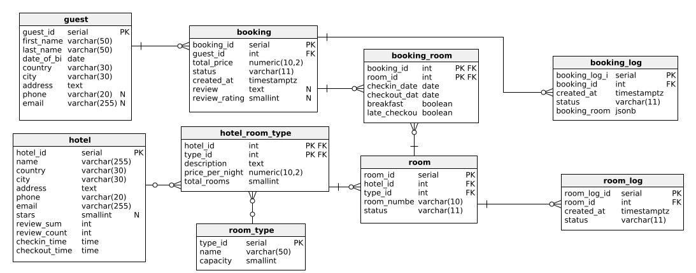

# System rezerwacji hotelowych

**Autorzy:** 

[Jakub Fabia](https://github.com/jakub-fabia)

[Michał Gontarz](https://github.com/gontarsky04)

---

## 1. Model danych



Kompletne definicje SQL znajdują się w pliku [`sql/tables.sql`](./sql/tables.sql).

---

<div style="page-break-after: always;"></div>


### 1.1 Tabela `hotel`

> Jednostka noclegowa widoczna w wynikach wyszukiwania (hotel, pensjonat, domek, hostel). Osoba zarządzająca hotelem ma dostęp do raportów sprzedaży i logów.

| Kolumna       | Typ                  | Klucz / ograniczenia         | Znaczenie                                  |
| ------------- | -------------------- | ---------------------------- | ------------------------------------------ |
| hotel_id      | SERIAL               | **PK**                       | Identyfikator hotelu                       |
| name          | VARCHAR **NOT NULL** |                              | Nazwa obiektu widoczna w ofercie           |
| country       | VARCHAR **NOT NULL** |                              | Kraj                                       |
| city          | VARCHAR **NOT NULL** |                              | Miasto / miejscowość                       |
| stars         | SMALLINT             | NULL OR 1 ≤ stars ≤ 5        | Oficjalna kategoryzacja (1–5★)             |
| address       | TEXT **NOT NULL**    |                              | Ulica + nr domu/mieszkania                 |
| phone         | VARCHAR **NOT NULL** | UNIQUE                       | Telefon recepcji                           |
| checkin_time  | TIME **NOT NULL**    | checkin_time > checkout_time | Standardowa godzina zameldowania           |
| checkout_time | TIME **NOT NULL**    |                              | Standardowa godzina wymeldowania           |
---
> Każda czwórka (name, country, city, adress) musi być unikalna.

<div style="page-break-after: always;"></div>

### 1.2 Tabela `room_type`

> Globalny katalog kategorii pokoi oferowanych na platformie (np. pokój hotelowy, apartament, domek, łóżko hostelowe).

| Kolumna     | Typ                   | Klucz / ograniczenia | Znaczenie                                       |
| ----------- | --------------------- | -------------------- | ----------------------------------------------- |
| type_id     | SERIAL                | **PK**               | Identyfikator typu                              |
| name        | VARCHAR **NOT NULL**  |     UNIQUE                 | Nazwa kategorii ("Apartament", "Łóżko"...)      |
---

<div style="page-break-after: always;"></div>

### 1.3 Tabela `room`

> Każda fizyczna jednostka noclegowa (konkretny pokój 101, domek 5, łóżko #4 w hostelu).

| Kolumna         | Typ                      | Klucz / ograniczenia                  | Znaczenie                             |
| --------------- | ------------------------ | ------------------------------------- | -------------------------------       |
| room_id         | SERIAL                   | **PK**                                | Identyfikator pokoju                  |
| hotel_id        | INT   **NOT NULL**       | FK części skł. PK → `hotel`           | Hotel, do którego należy pokój        |
| room_type_id    | INT   **NOT NULL**       | FK części skł. PK → `room_type`       | Kategoria pokoju                      |
| room_number     | VARCHAR **NOT NULL**     | UNIQUE(hotel_id, room_number)         | Numer "jednostki noclegowej"          |
| capacity        | SMALLINT **NOT NULL**    | capacity > 0                          | Liczba osób, które można zakwaterować |
| price_per_night | NUMERIC **NOT NULL**     | price > 0                             | Aktualna cena za noc                  |
---

<div style="page-break-after: always;"></div>

### 1.4 Tabela `room_log`

> Historia zmian statusu dla każdego pokoju (dla raportów o poszczególnych pokojach).

| Kolumna         | Typ                   | Klucz / ograniczenia     | Znaczenie                     |
| --------------- | --------------------- | ------------------------ | ----------------------------- |
| room_log_id     | SERIAL                | **PK**                   | Klucz sztuczny                |
| room_id         | INT                   | FK → `room`              | Obiekt, którego dotyczy wpis  |
| created_at      | TIMESTAMPTZ           | DEFAULT now()            | Znacznik czasu zmiany         |
| price_per_night | NUMERIC **NOT NULL**  | price > 0                | Aktualna cena za noc          |

---

<div style="page-break-after: always;"></div>

### 1.5 Tabela `guest`

> Dane kontaktowe klienta składającego rezerwację.

| Kolumna                | Typ                  | Klucz / ograniczenia    | Znaczenie                  |
| ---------------------- | -------------------- | ----------------------- | -------------------------- |
| guest_id               | SERIAL               | **PK**                  | Identyfikator gościa       |
| first_name / last_name | VARCHAR **NOT NULL** |                         | Imię i nazwisko            |
| date_of_birth          | DATE **NOT NULL**    | date_of_birth < today   | Data urodzenia             |
| country                | VARCHAR **NOT NULL** |                         | Kraj zamieszkania          |
| city                   | VARCHAR **NOT NULL** |                         | Miasto zamieszkania        |
| address                | TEXT **NOT NULL**    |                         | Ulica + nr domu/mieszkania |
| phone                  | VARCHAR              | UNIQUE                  | Telefon kontaktowy         |
| email                  | VARCHAR              | UNIQUE                  | E‑mail                     |

---
> Jedna z wartości w dwójce (email, phone) musi być NOT NULL.

<div style="page-break-after: always;"></div>

### 1.6 Tabela `booking`

> Nagłówek rezerwacji (dane wspólne dla wszystkich pokoi w jednym zamówieniu).

| Kolumna                      | Typ                      | Klucz / ograniczenia       | Znaczenie                      |
| ---------------------------- | ------------------------ | -------------------------- | ------------------------------ |
| booking_id                   | SERIAL                   | **PK**                     | Identyfikator zamówienia       |
| guest_id                     | INT   **NOT NULL**       | FK → `guest`               |                                |
| hotel_id                     | INT   **NOT NULL**       | FK części skł. PK → `hotel`| Hotel, do którego należy pokój |
| total_price                  | NUMERIC **NOT NULL**     | total_price > 0            | Kwota za całe zamówienie       |
| status                       | VARCHAR **NOT NULL**     | DEFAULT 'PENDING'          | Aktualny status rezerwacji     |
| created_at                   | TIMESTAMPTZ **NOT NULL** | DEFAULT now()              | Data utworzenia rezerwacji     |

---

<div style="page-break-after: always;"></div>

### 1.7 Tabela `booking_room`

> Szczegóły rezerwacji — które pokoje wchodzą w skład jednego `booking` i z jakimi dodatkami.

| Kolumna          | Typ                  | Klucz / ograniczenia          | Znaczenie                |
| ---------------- | -------------------- | ----------------------------- | ------------------------ |
| booking_room_id  | INT                  | **PK** fk → `booking`         |                          |
| booking_id       | INT                  | FK część skł. PK -> `booking' | Identyfikator zamówienia |
| room_id          | INT **NOT NULL**     | FK część skł. PK -> `room`    | Rezerwowany pokój        |
| checkin_date     | DATE **NOT NULL**    | checkout > checkin            | Data zameldowania        |
| checkout_date    | DATE **NOT NULL**    | checkout > checkin            | Data wymeldowania        |
---

<div style="page-break-after: always;"></div>

### 1.8 Tabela `booking_log`

> Migawka zmian rezerwacji obejmująca główne pola oraz listę pokojów (w formacie JSON).

| Kolumna         | Typ                  | Klucz / ograniczenia  | Znaczenie                                                         |
| --------------- | -------------------- | --------------------- | ----------------------------------------------------------------- |
| booking_log_id  | SERIAL               | **PK**                |                                                                   |
| booking_id      | INT                  | FK → `booking`        |                                                                   |
| created_at      | TIMESTAMPTZ          | DEFAULT now()         |                                                                   |
| total_price     | NUMERIC **NOT NULL** | total_price > 0       | Kwota za całe zamówienie                                          |
| status          | VARCHAR              |                       | Nowy status zamówienia                                            |
| booking_rooms   | JSONB                |                       | Nowe szczegóły zamówienia w formie `{room_id, checkin, checkout}` |

---

### 1.9 Założenia i uproszczenia

* Ceny sezonowe nie są modelowane — zakładamy jedną stawkę `price_per_night` na dany pokój
* Obsługa płatności nie będzie implementowana.

### 1.10 Kod generujący tabele

```sql
CREATE TABLE hotel (
  hotel_id      SERIAL       PRIMARY KEY,
  name          VARCHAR(255) NOT NULL,
  country       VARCHAR(30)  NOT NULL,
  city          VARCHAR(30)  NOT NULL,
  stars         SMALLINT,
  address       TEXT         NOT NULL,
  phone         VARCHAR(20)  NOT NULL,
  checkin_time  TIME         NOT NULL,
  checkout_time TIME         NOT NULL
);

CREATE TABLE room_type (
  room_type_id     SERIAL      PRIMARY KEY,
  name             VARCHAR(50) NOT NULL
);

CREATE TABLE room (
  room_id         SERIAL        PRIMARY KEY,
  hotel_id        INT           NOT NULL REFERENCES hotel,
  room_type_id    INT           NOT NULL REFERENCES room_type,
  room_number     VARCHAR(10)   NOT NULL,
  capacity        SMALLINT      NOT NULL,
  price_per_night NUMERIC(10,2) NOT NULL
);

CREATE TABLE room_log (
  room_log_id     SERIAL         PRIMARY KEY,
  room_id         INT            NOT NULL REFERENCES room,
  created_at      TIMESTAMPTZ    NOT NULL DEFAULT now(),
  price_per_night NUMERIC(10,2)  NOT NULL
);

CREATE TABLE guest (
  guest_id      SERIAL       PRIMARY KEY,
  first_name    VARCHAR(50)  NOT NULL,
  last_name     VARCHAR(50)  NOT NULL,
  date_of_birth DATE         NOT NULL,
  country       VARCHAR(30)  NOT NULL,
  city          VARCHAR(30)  NOT NULL,
  address       TEXT         NOT NULL,
  phone         VARCHAR(20),
  email         VARCHAR(255)
);

CREATE TABLE booking (
  booking_id     SERIAL         PRIMARY KEY,
  guest_id       INT            NOT NULL REFERENCES guest,
  hotel_id       INT            NOT NULL REFERENCES hotel,
  total_price    NUMERIC(10,2)  NOT NULL,
  status         VARCHAR(11)    NOT NULL DEFAULT 'PENDING',
  created_at     TIMESTAMPTZ    NOT NULL DEFAULT now()
);

CREATE TABLE booking_room (
  booking_room_id SERIAL        PRIMARY KEY,
  booking_id      INT,
  room_id         INT           NOT NULL REFERENCES room,
  checkin_date    DATE          NOT NULL,
  checkout_date   DATE          NOT NULL
);

CREATE TABLE booking_log (
  booking_log_id SERIAL         PRIMARY KEY,
  booking_id     INT            NOT NULL REFERENCES booking,
  created_at     TIMESTAMPTZ    NOT NULL DEFAULT now(),
  total_price    NUMERIC(10,2)  NOT NULL,
  status         VARCHAR(11)    NOT NULL,
  booking_rooms  JSONB          NOT NULL
);
```

<div style="page-break-after: always;"></div>

## 2. Reguły integralności & indeksy

Reguły integralności oraz indeksy poprawiające wydajność opisano w pliku [`sql/constraints_indexes.sql`](./sql/constraints_indexes.sql).


Poza wypisanymi w tabelce ograniczeniami dodano:
* Wymaganie co najmniej jednego kontaktu (telefon lub e‑mail) w tabeli `guest`.
* Brak nakładających się rezerwacji na ten sam pokój.

```sql
ALTER TABLE hotel
  ADD UNIQUE(name, country, city, address),
  ADD UNIQUE(phone),
  ADD CHECK (stars IS NULL OR stars BETWEEN 1 AND 5),
  ADD CHECK (checkin_time > checkout_time);

ALTER TABLE room_type
  ADD UNIQUE (name);

ALTER TABLE room
  ADD UNIQUE(hotel_id, room_number),
  ADD CHECK (price_per_night > 0),
  ADD CHECK (capacity > 0);

ALTER TABLE guest
  ADD UNIQUE(email),
  ADD UNIQUE(phone),
  ADD CHECK (date_of_birth < CURRENT_DATE),
  ADD CHECK (email IS NOT NULL OR phone IS NOT NULL);

ALTER TABLE booking_log
ADD CONSTRAINT fk_booking
FOREIGN KEY (booking_id)
REFERENCES booking(booking_id)
ON DELETE SET NULL;

ALTER TABLE booking
  ADD CHECK (total_price > 0),
  ADD CHECK (status IN ('PENDING', 'CONFIRMED', 'CANCELLED', 'CHECKED_IN', 'COMPLETED'));

ALTER TABLE booking_room
  ADD CHECK (checkout_date > checkin_date);

CREATE EXTENSION IF NOT EXISTS btree_gist;

ALTER TABLE booking_room
  ADD CONSTRAINT no_room_overlap
  EXCLUDE USING gist (
       room_id                                  WITH =,
       daterange(checkin_date, checkout_date)   WITH &&
  );
```

<div style="page-break-after: always;"></div>

Utworzyliśmy także indeksy poprawiające wydajność bazy danych:
* Na klucze obce (PostgreSQL nie tworzy ich automatycznie).
* Do wyszukiwania dostępnych pokoi (`hotel_id + room_type_id`).
* Do sprawdzania rezerwacji między datami.
* Do logów po dacie utworzenia.


```sql
CREATE INDEX idx_room_hotel       ON room            (hotel_id);
CREATE INDEX idx_room_type        ON room            (room_type_id);
CREATE INDEX idx_booking_guest    ON booking         (guest_id);
CREATE INDEX idx_booking_room_room ON booking_room    (room_id);

CREATE INDEX idx_room_hotel_type ON room (hotel_id, room_type_id);

CREATE INDEX idx_booking_room_dates ON booking_room (checkin_date, checkout_date);

CREATE INDEX idx_room_log_room_ts ON room_log (room_id, created_at DESC);
CREATE INDEX idx_booking_log_booking_ts ON booking_log (booking_id, created_at DESC);
```

<div style="page-break-after: always;"></div>

## 3. Triggery

Do obsługi takich rzeczy jak:
* Tworzenie logów (wraz z tworzeniem JSON do `booking_log`),
* Kontrola rezerwacji pokoi (w jednej rezerwacji mogą znajdować się tylko pokoi z tego samego hotelu),

wykorzystano triggery.

```sql
CREATE OR REPLACE FUNCTION trg_room_status_log()
RETURNS trigger LANGUAGE plpgsql AS $$
BEGIN
  INSERT INTO room_log(room_id, created_at, price_per_night)
  VALUES (NEW.room_id, now(), NEW.price_per_night);
  RETURN NEW;
END $$;

CREATE TRIGGER room_aiu_log
AFTER INSERT OR UPDATE ON room
FOR EACH ROW EXECUTE FUNCTION trg_room_status_log();

CREATE OR REPLACE FUNCTION f_insert_booking_log()
RETURNS trigger LANGUAGE plpgsql AS $$
DECLARE
  b          booking;
  rooms_json jsonb;
BEGIN
  SELECT * INTO b FROM booking WHERE booking_id = NEW.booking_id;

  SELECT jsonb_agg(jsonb_build_object(
           'room_id',       room_id,
           'checkin_date',  checkin_date,
           'checkout_date', checkout_date))
    INTO rooms_json
  FROM booking_room
  WHERE booking_id = NEW.booking_id;

  INSERT INTO booking_log(booking_id, created_at, total_price, status, booking_rooms)
  VALUES (b.booking_id, now(), b.total_price, b.status, COALESCE(rooms_json, '[]'::jsonb));
  RETURN NEW;
END $$;

CREATE TRIGGER booking_aiu_log
AFTER INSERT OR UPDATE ON booking
FOR EACH ROW EXECUTE FUNCTION f_insert_booking_log();

CREATE OR REPLACE FUNCTION check_booking_rooms_same_hotel()
RETURNS TRIGGER AS $$
DECLARE
    existing_hotel_id INT;
    new_room_hotel_id INT;
BEGIN
    SELECT r.hotel_id INTO new_room_hotel_id
    FROM room r
    WHERE r.room_id = NEW.room_id;

    SELECT r.hotel_id INTO existing_hotel_id
    FROM booking_room br
    JOIN room r ON r.room_id = br.room_id
    WHERE br.booking_id = NEW.booking_id
    LIMIT 1;

    IF existing_hotel_id IS NOT NULL AND existing_hotel_id <> new_room_hotel_id THEN
        RAISE EXCEPTION 'All rooms in a single booking must belong to the same hotel.';
    END IF;

    RETURN NEW;
END;
$$ LANGUAGE plpgsql;

CREATE TRIGGER trg_check_booking_room_hotel
BEFORE INSERT ON booking_room
FOR EACH ROW
EXECUTE FUNCTION check_booking_rooms_same_hotel();
```
---

## 4. Framework do obsługi bazy danych i endpointów

Frameworkiem na jaki zdecydowaliśmy się do realizacji projektu jest Java Spring Boot. 
Bibliotekami które użyliśmy do utworzenia projektu są:
- Spring Boot Data JPA
- Spring Boot Validation
- Spring Boot Web
- Spring Boot DevTools
- MapStruct
- Lombok

Wszystie dostępne operacje CRUD zostały zapisane w programie `Postman`.

# Tutaj odnośnik do konfiguracji postmana.

## 5. Operacje na bazie danych

Wszystkie operacje używają jednej z dwóch adnotacji:

* `@Transactional(readOnly = true)` – oznacza, że operacja jest atomowa i przeznaczona wyłącznie do odczytu.
* `@Transactional` – oznacza, że operacja modyfikuje dane w bazie i również jest atomowa.

W dokumentacji, gdy mowa o `...Repository`, chodzi o użycie klas z pakietu `repository`, opartych o:

* `JpaRepository` z biblioteki **Spring Data JPA** – znacznie upraszcza tworzenie zapytań do jednej tabeli,
* `JpaSpecificationExecutor` z tej samej biblioteki – umożliwia tworzenie dynamicznych filtrów zapytań,
* `@Query` – stosowane, gdy wymagane jest ręczne zdefiniowanie zapytania SQL (każda taka metoda zostanie opisana przy odpowiednim endpointzie).

Do tworzenia i aktualizacji encji użyto uproszczonych obiektów z pakietu `dto` (Data Transfer Object). Zawierają one tylko niezbędne atrybuty. Znajduje się tam również uproszczona wersja klasy `Guest` wykorzystywana w odpowiedziach.

Obiekty odpowiadające encjom (czyli klasom reprezentującym tabele w bazie danych) znajdują się w pakiecie `domain`.

Krótki opis działania endpointów, wraz z wymaganymi i opcjonalnymi polami, znajduje się przy metodach w pakiecie `controller`.

Pakiet `specification` zawiera definicje filtrów do dynamicznych zapytań.

Pakiet `service` zawiera implementacje operacji, w tym walidację danych.

Walidacja danych może odbywać się na kilku poziomach:

* bezpośrednio w metodach endpointów (`controller`),
* we wszystkich warstwach pomiędzy kontrolerem a `JpaRepository`,
* w obiektach encji (`domain`), np. za pomocą adnotacji walidacyjnych.

Obsługa wyjątków, komunikaty błędów oraz odpowiedzi sukcesu są realizowane przez mechanizmy globalne.

---

### `SuccessResponse.java`

```java
public class SuccessResponse {
    private final int status;
    private final String message;
    private final Instant timestamp;

    public SuccessResponse(int status, String message, Instant timestamp) {
        this.status = status;
        this.message = message;
        this.timestamp = timestamp;
    }

    public int getStatus() {
        return status;
    }

    public String getMessage() {
        return message;
    }

    public Instant getTimestamp() {
        return timestamp;
    }
}
```

### `ErrorResponse.java`

```java
public class ErrorResponse {
    private final int status;
    private final String message;
    private final Instant timestamp;

    public ErrorResponse(int status, String message, Instant timestamp) {
        this.status = status;
        this.message = message;
        this.timestamp = timestamp;
    }

    public int getStatus() {
        return status;
    }

    public String getMessage() {
        return message;
    }

    public Instant getTimestamp() {
        return timestamp;
    }
}
```

### `GlobalExceptionHandler.java`

```java
@RestControllerAdvice
public class GlobalExceptionHandler {

    @ExceptionHandler(EntityNotFoundException.class)
    public ResponseEntity<ErrorResponse> handleNotFound(EntityNotFoundException ex) {
        ErrorResponse error = new ErrorResponse(
                HttpStatus.NOT_FOUND.value(),
                ex.getMessage(),
                Instant.now()
        );
        return new ResponseEntity<>(error, HttpStatus.NOT_FOUND);
    }

    @ExceptionHandler(MethodArgumentNotValidException.class)
    public ResponseEntity<ErrorResponse> handleValidation(MethodArgumentNotValidException ex) {
        String message = ex.getBindingResult().getFieldErrors().stream()
                .map(fe -> fe.getField() + ": " + fe.getDefaultMessage())
                .collect(Collectors.joining(", "));
        ErrorResponse error = new ErrorResponse(
                HttpStatus.BAD_REQUEST.value(),
                message,
                Instant.now()
        );
        return new ResponseEntity<>(error, HttpStatus.BAD_REQUEST);
    }

    @ExceptionHandler(DataIntegrityViolationException.class)
    public ResponseEntity<ErrorResponse> handleDataIntegrity(DataIntegrityViolationException ex) {
        String raw = ex.getMostSpecificCause().getMessage();
        ErrorResponse error = new ErrorResponse(
                HttpStatus.CONFLICT.value(),
                raw,
                Instant.now()
        );
        return new ResponseEntity<>(error, HttpStatus.CONFLICT);
    }

    @ExceptionHandler(IllegalStateException.class)
    public ResponseEntity<ErrorResponse> handleIllegalState(IllegalStateException ex) {
        ErrorResponse error = new ErrorResponse(
                HttpStatus.BAD_REQUEST.value(),
                ex.getMessage(),
                Instant.now()
        );
        return new ResponseEntity<>(error, HttpStatus.BAD_REQUEST);
    }

    @ExceptionHandler(Exception.class)
    public ResponseEntity<ErrorResponse> handleAll(Exception ex) {
        ErrorResponse error = new ErrorResponse(
                HttpStatus.INTERNAL_SERVER_ERROR.value(),
                "Wystąpił nieoczekiwany błąd",
                Instant.now()
        );
        return new ResponseEntity<>(error, HttpStatus.INTERNAL_SERVER_ERROR);
    }
}
```

---

### `GET /api/bookings/{id}`

**Metoda:** `BookingService.get(Integer id)`

**Opis:** 
Pobiera szczegóły zamówienia o podanym identyfikatorze.

**Parametry:**

* `id` – identyfikator zamówienia (wymagany)

**Przebieg metody:**

1. Walidacja obecności zamówienia o podanym `id`.
2. Rzucenie wyjątku `EntityNotFoundException` jeśli nie istnieje.
3. Zwrócenie obiektu `Booking`.

**Zwraca:**
Obiekt `Booking` w formacie JSON / Wiadomość o błędzie

---

### `POST /api/bookings`

**Metoda:** `BookingService.create(BookingCreateRequest request)`

**Opis:** 
Tworzy nowe zamówienie z danych przesłanych w ciele żądania.

**Parametry:**

* `request` – obiekt `BookingCreateRequest` (wymagany)

**Walidacja:**

* Adnotacje walidacyjne w `BookingCreateRequest`, np. `@NotNull`, `@Future`, `@Valid`.
* Sprawdzenie poprawności danych (np. istnienia klienta, pokoju, dostępności terminu).

**Przebieg metody:**

1. Walidacja pól wejściowych.
2. Sprawdzenie dostępności zasobów (pokój, daty).
3. Utworzenie nowego obiektu `Booking` i zapis do bazy.
4. Zwrócenie utworzonego obiektu.

**Zwraca:**
Nowo utworzony `Booking` jako JSON / Wiadomość o błędzie

**Przykład JSON (request):**

```json
{
    "guestId": "3",
    "hotelId": "1",
    "status": "PENDING",
    "bookingRooms": [
        {
            "roomId": "1",
            "checkinDate": "2025-08-09",
            "checkoutDate": "2025-08-11"
        }
    ]
}
```

---

### `PUT /api/bookings/{id}`

**Metoda:** `BookingService.update(Integer id, BookingUpdateRequest request)`

**Opis:** 
Aktualizuje istniejące zamówienie na podstawie przekazanych danych.

**Parametry:**

* `id` – identyfikator zamówienia (wymagany)
* `request` – obiekt `BookingUpdateRequest` (wymagany)

**Walidacja:**

* Adnotacje w `BookingUpdateRequest`.
* Sprawdzenie spójności dat i dostępności zasobów.

**Przebieg metody:**

1. Walidacja istnienia zamówienia.
2. Walidacja i przetworzenie pól z `BookingUpdateRequest`.
3. Zmodyfikowanie i zapisanie encji `Booking`.

**Zwraca:**
Zaktualizowany obiekt `Booking` / Wiadomość o błędzie

**Przykład JSON (request):**

```json
{
    "status": "PENDING",
    "bookingRooms": [
        {
            "roomId": "1",
            "checkinDate": "2025-07-17",
            "checkoutDate": "2025-07-20"
        }
    ]
}
```

---

### `PATCH /api/bookings/{id}?status={status}`

**Metoda:** `BookingService.changeStatus(Integer id, BookingStatus status)`

**Opis:** 
Zmienia status istniejącego zamówienia.

**Parametry:**

* `id` – identyfikator zamówienia (wymagany)
* `status` – nowy status (`BookingStatus`, wymagany)

```java
public enum BookingStatus {
    PENDING,
    CONFIRMED,
    CANCELLED,
    CHECKED_IN,
    COMPLETED
}
```

**Walidacja:**

* Sprawdzenie poprawności statusu.
* Walidacja istnienia zamówienia.

**Przebieg metody:**

1. Znalezienie zamówienia.
2. Walidacja zmiany stanu (jeśli obowiązują reguły).
3. Ustawienie nowego statusu i zapis do bazy.

**Zwraca:**
Zaktualizowany obiekt `Booking` / Wiadomość o błędzie

**Przykład użycia:**
`PATCH /api/bookings/7?status=CANCELLED`

---

### `DELETE /api/bookings/{id}`

**Metoda:** `BookingService.delete(Integer id)`

**Opis:** 
Usuwa zamówienie o podanym `id`.

**Parametry:**

* `id` – identyfikator zamówienia (wymagany)

**Walidacja:**

* Sprawdzenie istnienia zamówienia.
* Możliwa weryfikacja, czy status zamówienia pozwala na usunięcie.

**Przebieg metody:**

1. Sprawdzenie czy zamówienie istnieje.
2. Ewentualna walidacja reguł (np. brak powiązań uniemożliwiających usunięcie).
3. Usunięcie rekordu z bazy danych.

**Zwraca:**
Brak treści (`void`) / Wiadomość o błędzie

---

### `GET /api/guests?firstName={...}&lastName={...}&email={...}&phone={...}`

**Metoda:** `GuestService.list(String firstName, String lastName, String email, String phone, Pageable pageable)`

**Opis:** 
Zwraca paginowaną listę gości na podstawie podanych filtrów (imienia, nazwiska, e-maila i telefonu).

**Parametry:**

* `firstName`, `lastName`, `email`, `phone` – pola opcjonalne, używane do filtrowania wyników
* `pageable` – parametry paginacji (`page`, `size`, `sort`)

**Walidacja:**

* Brak wymagań co do obecności parametrów
* Sprawdzenie poprawności paginacji (Spring robi to automatycznie)

**Przebieg:**

1. Utworzenie specyfikacji filtrującej (`GuestSpecification`)
2. Pobranie wyników z bazy z użyciem repozytorium
3. Mapowanie wyników na `GuestSummary`
4. Zwrócenie strony wyników

**Zwraca:**
Obiekt `Page<GuestSummary>`, czyli lista gości z paginacją

---

### `GET /api/guests/bookings/{id}`

**Metoda:** `GuestService.getBookings(Integer id)`

**Opis:** 
Zwraca szczegóły gościa o podanym `id`, wraz z jego rezerwacjami i informacjami o pokojach.

**Parametry:**

* `id` – identyfikator gościa (wymagany)

**Walidacja:**

* Sprawdzenie, czy gość o danym `id` istnieje

**Przebieg:**

1. Wykonanie zapytania `findWithBookingsAndRoomsById`
```java
    @Query("""
      select g
      from Guest g
      left join fetch g.bookings b
      left join fetch b.bookingRooms br
      where g.id = :id
      """)
    Optional<Guest> findWithBookingsAndRoomsById(@Param("id") Integer id);
```
2. Rzucenie wyjątku `EntityNotFoundException`, jeśli nie znaleziono
3. Zwrócenie obiektu `Guest` wraz z jego rezerwacjami i pokojami

**Zwraca:**
Obiekt `Guest` z pełną strukturą rezerwacji

---

### `GET /api/guests/{id}`

**Metoda:** `GuestService.get(Integer id)`

**Opis:** 
Pobiera podstawowe informacje o gościu o podanym `id`, bez rezerwacji.

**Parametry:**

* `id` – identyfikator gościa (wymagany)

**Walidacja:**

* Sprawdzenie, czy gość istnieje

**Przebieg:**

1. Pobranie gościa z repozytorium
2. Rzucenie wyjątku `EntityNotFoundException` w przypadku braku
3. Mapowanie obiektu `Guest` na `GuestSummary`

**Zwraca:**
Obiekt `GuestSummary`

---

### `POST /api/guests`

**Metoda:** `GuestService.create(GuestCreateRequest req)`

**Opis:** 
Tworzy nowego gościa na podstawie danych przesłanych w ciele żądania.

**Parametry:**

* `body` – obiekt JSON typu `GuestCreateRequest` zawierający dane gościa

**Walidacja:**

M.in.:
* `@NotBlank` dla imienia, nazwiska
* `@Email` dla adresu e-mail
* `@Past` dla daty urodzenia
* Adnotacje sprawdzane automatycznie przez Spring przy `@Valid`

**Przebieg:**

1. Walidacja danych z `GuestCreateRequest`
2. Przekształcenie DTO na encję `Guest` (mapper)
3. Zapis gościa w bazie danych
4. Logowanie operacji

**Zwraca:**
Nowo utworzony obiekt `Guest` jako JSON

**Przykład JSON (request):**

```json
{
  "firstName": "Jakub",
  "lastName": "Fabia",
  "dateOfBirth": "2022-12-06",
  "country": "Polska",
  "city": "Krakow",
  "address": "aihbdas",
  "phone": "23872132",
  "email": "haelixzas@asibd.asd"
}
```

---

### `PUT /api/guests/{id}`

**Metoda:** `GuestService.update(Integer id, GuestUpdateRequest req)`

**Opis:** 
Aktualizuje dane istniejącego gościa o podanym `id`.

**Parametry:**

* `id` – identyfikator gościa
* `body` – obiekt JSON typu `GuestUpdateRequest` z danymi do aktualizacji

**Walidacja:**

* Walidacja adnotacjami w `GuestUpdateRequest`
* Sprawdzenie, czy gość istnieje

**Przebieg:**

1. Pobranie gościa z repozytorium
2. Walidacja danych wejściowych
3. Zaktualizowanie pól encji przez mappera
4. Zapis zmian w ramach transakcji

**Zwraca:**
Zaktualizowany obiekt `Guest`

**Przykład JSON (request):**

```json
{
  "firstName": "Jakub",
  "lastName": "Fabia",
  "dateOfBirth": "2022-12-06",
  "country": "Polska",
  "city": "Krakow",
  "address": "aihbdas",
  "phone": "23872132",
  "email": "haelixzas@asibd.asd"
}
```

---

### `DELETE /api/guests/{id}`

**Metoda:** `GuestService.delete(Integer id)`

**Opis:** 
Usuwa gościa o podanym identyfikatorze.

**Parametry:**

* `id` – identyfikator gościa

**Walidacja:**

* Sprawdzenie, czy gość istnieje
* Dodatkowe ograniczenia wymuszone przez DBMS (nieusuwanie gościa z rezerwacjami)

**Przebieg:**

1. Sprawdzenie istnienia rekordu
2. Usunięcie gościa z bazy
3. Zalogowanie informacji o operacji
4. Zwrócenie komunikatu `SuccessResponse`

**Zwraca:**
Obiekt `SuccessResponse` z komunikatem usunięcia

---

### `GET /api/hotels/all`

**Metoda:** `HotelService.getAll(Pageable pageable)`

**Opis:** 
Zwraca wszystkie hotele w formie paginowanej, bez żadnych filtrów.

**Parametry:**

* `page`, `size`, `sort` – parametry paginacji (opcjonalne)

**Walidacja:**

* Walidacja formatu parametrów paginacji (realizowana przez Spring)

**Przebieg:**

1. Pobranie wszystkich hoteli z bazy danych przy użyciu repozytorium
2. Zwrócenie paginowanej listy

**Zwraca:**
Obiekt `Page<Hotel>`

---

### `GET /api/hotels?city={}&country={}&name={}&stars={}`

**Metoda:** `HotelService.list(String country, String city, String name, Integer stars, Pageable pageable)`

**Opis:** 
Zwraca listę hoteli spełniających podane kryteria: kraj, miasto, nazwa, liczba gwiazdek.

**Parametry:**

* `country`, `city`, `name`, `stars` – pola opcjonalne
* `page`, `size`, `sort` – parametry paginacji

**Walidacja:**

* Brak obowiązkowych pól
* Spring waliduje typy i paginację

**Przebieg:**

1. Zbudowanie dynamicznej specyfikacji z filtrami (`HotelSpecification`)
2. Pobranie wyników z bazy danych
3. Zwrócenie paginowanej listy

**Zwraca:**
Obiekt `Page<Hotel>`

---

### `GET /api/hotels/{id}`

**Metoda:** `HotelService.get(Long id)`

**Opis:** 
Zwraca szczegóły hotelu o podanym identyfikatorze.

**Parametry:**

* `id` – identyfikator hotelu (wymagany)

**Walidacja:**

* Sprawdzenie istnienia hotelu
* Rzucenie `EntityNotFoundException` w przypadku braku

**Przebieg:**

1. Pobranie hotelu z repozytorium
2. Zwrócenie obiektu

**Zwraca:**
Obiekt `Hotel`

---

### `GET /api/hotels/{id}/occupancy?date={...}`

**Metoda:** `HotelService.listOccupancy(Long hotelId, LocalDate date)`

**Opis:** 
Zwraca listę rezerwacji z zajętymi pokojami w danym hotelu i danym dniu.

**Parametry:**

* `id` (ścieżka) – identyfikator hotelu
* `date` (query) – dzień, którego dotyczy obłożenie

**Walidacja:**

* `@DateTimeFormat` i obecność parametru `date`
* Sprawdzenie istnienia hotelu

**Przebieg:**

1. Pobranie wszystkich `BookingRoom` pasujących do daty i hotelu
2. Grupowanie po rezerwacjach
3. Przypisanie zajętych pokoi do obiektów `Booking`
4. Zwrócenie listy `Booking`

**Zwraca:**
Lista obiektów `Booking` z zajętymi pokojami

---

### `GET /api/hotels/{id}/available?checkin={...}&checkout={...}&roomTypeId={...}&minCapacity={...}&minPrice={...}&maxPrice={...}`

**Metoda:** `HotelService.availableRooms(LocalDate checkin, LocalDate checkout, Integer roomTypeId, Short minCapacity, BigDecimal minPrice, BigDecimal maxPrice, Long hotelId, Pageable pageable)`

**Opis:** 
Zwraca `Page `dostępnych pokoji w danym hotelu na zadany przedział czasowy z opcjonalnymi filtrami.

**Parametry:**

* `id` – identyfikator hotelu
* `checkin` – data zameldowania
* `checkout` – data wymeldowania
* `roomTypeId`, `minCapacity`, `minPrice`, `maxPrice` – filtry (opcjonalny)

**Walidacja:**

* `@FutureOrPresent` dla dat
* Obowiązkowe `checkin` i `checkout`
* Sprawdzenie istnienia hotelu

**Przebieg:**

1. Przekazanie parametrów do zapytania w `RoomRepository`
2. Wyliczenie liczby dostępnych pokojów
3. Zwrócenie paginowanej listy

**Zwraca:**
Obiekt `Page<Room>`

---

### `POST /api/hotels`

**Metoda:** `HotelService.create(HotelCreateRequest req)`

**Opis:** 
Tworzy nowy hotel na podstawie danych z ciała żądania.

**Parametry:**

* `body` – obiekt `HotelCreateRequest` (JSON)

**Walidacja:**

* Adnotacje w DTO: `@NotBlank`, `@Size`, `@Pattern`, itp.
* Sprawdzenie poprawności wymaganych pól (nazwa, adres, telefon)

**Przebieg:**

1. Walidacja danych wejściowych
2. Konwersja DTO na encję (mapper)
3. Zapis hotelu do bazy
4. Zwrócenie utworzonego hotelu

**Zwraca:**
Nowy obiekt `Hotel`

**Przykład JSON (request):**

```json
{
  "name": "Hoteal1",
  "country": "Polska",
  "city": "Warszawa",
  "address": "Kawiory 12",
  "phone": "12411323",
  "checkinTime": "13:00",
  "checkoutTime": "10:00"
}
```

---

### `PUT /api/hotels/{id}`

**Metoda:** `HotelService.update(Long id, HotelUpdateRequest req)`

**Opis:** 
Aktualizuje dane hotelu o wskazanym identyfikatorze.

**Parametry:**

* `id` – identyfikator hotelu
* `body` – obiekt `HotelUpdateRequest` (JSON)

**Walidacja:**

* Walidacja danych z `HotelUpdateRequest`
* Sprawdzenie istnienia hotelu

**Przebieg:**

1. Pobranie hotelu z repozytorium
2. Zastosowanie zmian przy użyciu mappera
3. Zapis zmian w bazie

**Zwraca:**
Zaktualizowany obiekt `Hotel`

**Przykład JSON (request):**

```json
{
  "name": "Hoteal1",
  "country": "Polska",
  "city": "Warszawa",
  "address": "Kawiory 12",
  "phone": "12411323",
  "checkinTime": "13:00",
  "checkoutTime": "10:00",
  "stars": 3
}
```

---

### `DELETE /api/hotels/{id}`

**Metoda:** `HotelService.delete(Long id)`

**Opis:** 
Usuwa hotel o podanym `id`.

**Parametry:**

* `id` – identyfikator hotelu

**Walidacja:**

* Sprawdzenie, czy hotel istnieje
* Walidacja przez DBMS (np. czy hotel nie ma aktywnych rezerwacji)

**Przebieg:**

1. Sprawdzenie istnienia hotelu
2. Usunięcie z bazy
3. Logowanie operacji
4. Zwrócenie potwierdzenia w `SuccessResponse`

**Zwraca:**
Obiekt `SuccessResponse` z komunikatem

---

### `GET /api/rooms`

**Metoda:**
`RoomService.list(LocalDate checkin, LocalDate checkout, Integer roomTypeId, Short minCapacity, BigDecimal minPrice, BigDecimal maxPrice, String hotelCountry, String hotelCity, String hotelName, Integer hotelStars, Pageable pageable)`


**Opis:** 
Zwraca paginowaną listę dostępnych pokoi w zadanym przedziale dat, z opcjonalnym filtrowaniem (typ pokoju, pojemność, cena, lokalizacja, gwiazdki hotelu).

**Parametry:**

* `checkin` – data przyjazdu (wymagana)
* `checkout` – data wyjazdu (wymagana)
* `roomTypeId`, `minCapacity`, `minPrice`, `maxPrice`, `hotelCountry`, `hotelCity`, `hotelName`, `hotelStars` – parametry opcjonalne
* `page`, `size`, `sort` – paginacja

**Walidacja:**

* `@FutureOrPresent` na obu datach
* Walidacja, że `checkin < checkout`
* Walidacja typów i paginacji przez Spring

**Przebieg:**

1. Walidacja zakresu dat
2. Zbudowanie dynamicznej specyfikacji filtrującej (`RoomSpecification`)
3. Wykonanie zapytania do bazy
4. Zwrócenie paginowanej listy pokoi

**Zwraca:**
Obiekt `Page<Room>`

---

### `GET /api/rooms/{id}/available?checkin={...}&checkout={...}`

**Metoda:**
`RoomService.isAvailable(Long roomId, LocalDate checkin, LocalDate checkout)`


**Opis:** 
Sprawdza, czy dany pokój jest dostępny w określonym przedziale dat.

**Parametry:**

* `id` – identyfikator pokoju (ścieżka)
* `checkin`, `checkout` – daty przyjazdu i wyjazdu (wymagane)

**Walidacja:**

* `@FutureOrPresent` dla dat
* Sprawdzenie, że `checkin < checkout`
* Walidacja istnienia pokoju

**Przebieg:**

1. Walidacja danych wejściowych
2. Sprawdzenie istnienia pokoju
3. Zapytanie o konflikty w rezerwacjach (`bookingRoomRepo.existsBy...`)
4. Zwrócenie dostępności (prawda/fałsz)

**Zwraca:**
`true` lub `false` (czy pokój jest dostępny)

---

### `GET /api/rooms/{id}`

**Metoda:**
`RoomService.get(Long id)`


**Opis:** 
Zwraca szczegóły pokoju o podanym identyfikatorze.

**Parametry:**

* `id` – identyfikator pokoju (ścieżka)

**Walidacja:**

* Sprawdzenie istnienia pokoju w bazie
* Rzucenie `EntityNotFoundException` w przypadku braku

**Przebieg:**

1. Pobranie pokoju z repozytorium
2. Zwrócenie obiektu

**Zwraca:**
Obiekt `Room`

---

### `POST /api/rooms`

**Metoda:**
`RoomService.create(RoomCreateRequest req)`


**Opis:** 
Tworzy nowy pokój na podstawie przesłanych danych.

**Parametry:**

* `body` – JSON `RoomCreateRequest` z danymi pokoju

**Walidacja:**

* Adnotacje walidacyjne w `RoomCreateRequest` (np. `@Min`, `@NotNull`)
* Sprawdzenie istnienia hotelu (`hotelId`)
* Sprawdzenie istnienia typu pokoju (`roomTypeId`)

**Przebieg:**

1. Walidacja danych wejściowych
2. Mapowanie DTO na encję
3. Pobranie powiązanego hotelu i typu pokoju
4. Przypisanie ich do encji `Room`
5. Zapis pokoju do bazy
6. Zwrócenie utworzonego pokoju

**Zwraca:**
Nowy obiekt `Room`

**Przykład JSON (request):**

```json
{
    "hotelId": "1",
    "roomTypeId": "1",
    "roomNumber": "102a",
    "capacity": "2",
    "pricePerNight": "50"
}
```

---

### `PUT /api/rooms/{id}`

**Metoda:**
`RoomService.update(Long id, RoomUpdateRequest req)`


**Opis:** 
Aktualizuje dane pokoju o podanym identyfikatorze.

**Parametry:**

* `id` – identyfikator pokoju
* `body` – JSON `RoomUpdateRequest` z danymi do aktualizacji

**Walidacja:**

* Walidacja danych wejściowych (adnotacje w DTO)
* Sprawdzenie istnienia pokoju
* W razie potrzeby: sprawdzenie istnienia hotelu i typu pokoju (jeśli pola zostały podane)

**Przebieg:**

1. Pobranie pokoju z repozytorium
2. Aktualizacja pól przez mappera
3. Jeżeli podano nowe `hotelId`, przypisanie hotelu
4. Jeżeli podano nowe `roomTypeId`, przypisanie typu
5. Zapis zmian
6. Zwrócenie zaktualizowanego pokoju

**Zwraca:**
Zaktualizowany obiekt `Room`

**Przykład JSON (request):**

```json
{
    "hotelId": "1",
    "roomTypeId": "1",
    "roomNumber": "102a",
    "capacity": "2",
    "pricePerNight": "50"
}
```

---

### `GET /api/logs/bookings?bookingId={...}&from={...}&to={...}&status={...}`

**Metoda:**
`BookingLogRepository.findAll(Specification<BookingLog>, Pageable pageable)`


**Opis:** 
Zwraca paginowaną listę logów zmian w rezerwacjach. Można zawęzić wyniki, podając `bookingId`, zakres czasowy (`from`, `to`) oraz `BookingStatus`.

**Parametry:**

* `bookingId` – identyfikator rezerwacji (opcjonalny)
* `from` – dolna granica daty logu (`Instant`) (opcjonalna)
* `to` – górna granica daty logu (`Instant`) (opcjonalna)
* `status` – status rezerwacji po zmianie (opcjonalny)
* `page`, `size`, `sort` – paginacja

**Walidacja:**

* Spring automatycznie waliduje poprawność formatu dat (`@DateTimeFormat`)
* Brak obowiązkowych parametrów – wszystkie opcjonalne

**Przebieg:**

1. Zbudowanie dynamicznej specyfikacji (`BookingLogSpecification.filterBy(...)`)
2. Wykonanie zapytania z repozytorium
3. Zwrócenie paginowanej listy logów

**Zwraca:**
Obiekt `Page<BookingLog>`

---

### `GET /api/logs/rooms?roomId={...}&from={...}&to={...}`

**Metoda:**
`RoomLogRepository.findAll(Specification<RoomLog>, Pageable pageable)`


**Opis:** 
Zwraca paginowaną listę logów zmian związanych z pokojami (np. zmiana ceny, pojemności). Można filtrować po identyfikatorze pokoju oraz zakresie czasowym.

**Parametry:**

* `roomId` – identyfikator pokoju (opcjonalny)
* `from` – dolna granica czasowa (`Instant`) (opcjonalna)
* `to` – górna granica czasowa (`Instant`) (opcjonalna)
* `page`, `size`, `sort` – parametry paginacji

**Walidacja:**

* Automatyczna walidacja formatu `Instant` przez Spring
* Wszystkie parametry są opcjonalne

**Przebieg:**

1. Utworzenie dynamicznego zapytania (`RoomLogSpecification.filterBy(...)`)
2. Pobranie logów z bazy
3. Zwrócenie wyników w formie strony

**Zwraca:**
Obiekt `Page<RoomLog>`

---

## 6. Możliwości technologii wykorzystanych w projekcie

### 6.1 JSONB w tabeli `booking_log`

W logach rezerwacji zapisujemy pełną listę pokojów w pojedynczej kolumnie `booking_rooms JSONB` – w momencie modyfikacji system wykonuje migawkę `{room_id, checkin, checkout}` dla wszystkich pozycji rezerwacji. Dzięki temu historyczne dane są „samowystarczalne”: raport lub eksport może być odtworzony bez łączenia z bieżącymi tabelami.

Jedno-kolumnowy snapshot skraca czas zapytań analitycznych i chroni przed „zgubieniem” starych wartości po zmianach w głównych tabelach.

---

### 6.2 GiST + EXCLUDE — gwarancja braku nakładających się rezerwacji

#### Definicja reguły

```sql
ALTER TABLE booking_room
  ADD CONSTRAINT no_room_overlap
  EXCLUDE USING gist (
    room_id WITH =,
    daterange(checkin_date, checkout_date) WITH &&
  );
```

Ta pojedyncza klauzula zapewnia, że dla danego `room_id` dwa przedziały dat nie mogą się przeciąć.

* Spójność wymuszana już na poziomie bazy – warstwa usług nie musi wykonywać locków ani odpytywać stanu przed insertem.
* Indeks GiST działa szybko również przy milionach wierszy, bo porównuje tylko potrzebne fragmenty przedziałów.

---

### 6.3 Lombok — mniej boilerplate, czytelniejszy kod

Projekt korzysta z adnotacji `@Getter`, `@Setter`, `@Builder`, `@Data` i kilku innych, zdefiniowanych w zależnościach `Lombok`. Efekt to:

* dziesiątki klas encji i DTO bez ręcznego pisania getterów/setterów,
* obiekty testowe budowane eleganckim „builderem”.

---

### 6.4 Spring Data JPA — deklaratywne zapytania i **kontrola równoczesnego dostępu do danych**

* **Mechanizm transakcji (`@Transactional`) jest kluczową warstwą kontroli współbieżności**: każda metoda oznaczona tą adnotacją wykonuje się w ramach jednej transakcji Postgresa, a jeśli w jej trakcie wystąpi konflikt (np. złamanie constraintu GiST + EXCLUDE opis. w pkt 6.2), cała operacja zostaje automatycznie wycofana (rollback).
* Repozytoria dziedziczą po `JpaRepository`, a bardziej złożone filtry powstają dzięki `JpaSpecificationExecutor`; kod domenowy zawiera bardzo mało ręcznie pisanych `SELECT … FOR UPDATE`, bo to właśnie transakcja + constraint w bazie gwarantują spójność przy wielu równoległych żądaniach.
* Atrybut `readOnly = true` w `@Transactional` wymusza, że dane metody wykonują wyłącznie odczyty — eliminuje ryzyko przypadkowych zapisów i zmniejsza koszty blokad.


---

### 6.5 Spring DevTools — hot-reload w sekundę

Zależność `spring-boot-devtools` obserwuje zmianę plików `.class` i restartuje kontener niemal natychmiast.

---

### 6.6 Postman — powtarzalne testy API

Wszystkie operacje zapisane są w kolekcjach Postmana. Kolekcje pozwalają przetestować działanie endpointów w kontrolowanych warunkach.

---

### 6.7 Jakarta Bean Validation — walidacja deklaratywna

Adnotacje takie jak `@NotBlank`, `@Email`, `@Past` są umieszczone bezpośrednio w klasach requestów; Spring wywołuje walidator automatycznie przy `@Valid`. Błędy trafiają do globalnego handlera i wracają w jednolitym formacie JSON, więc front-end dostaje zawsze tę samą strukturę komunikatu.

---

### 6.8 MapStruct — typu-bezpieczne mapowanie DTO ↔ encje

W opisie każdego endpointu CREATE lub PUT pojawia się krok „Konwersja DTO na encję (mapper)”. Za generację tych mapperów odpowiada MapStruct, co daje:

* zero ręcznego „kopiuj pól”,
* compile-time sprawdzenie zgodności typów.

---

## 7. Dodatkowe technologie wykorzystane w projekcie

### 7.1 Konteneryzacja przy pomocy Dockera

Całe środowisko uruchomieniowe zostało rozłożone na trzy odrębne obrazy:

* **backend (Spring Boot)** – osobny kontener, w którym budujemy artefakt projekt i uruchamiamy go w obrazie `JDK 24`.
* **frontend (React JS)** – drugi kontener bazujący na `Node LTS`; w fazie budowania powstaje statyczny bundle, a w fazie uruchomienia serwuje go serwer `Nginx`.
* **baza danych (PostgreSQL)** – trzeci kontener oparty na obrazie `postgres:latest`, z dołączonym wolumenem na dane.

---

### 7.2 Frontend zbudowany w React JS

Warstwa prezentacji powstała w oparciu o **React** z wykorzystaniem:

# Tutaj biblioteki na frontendzie
