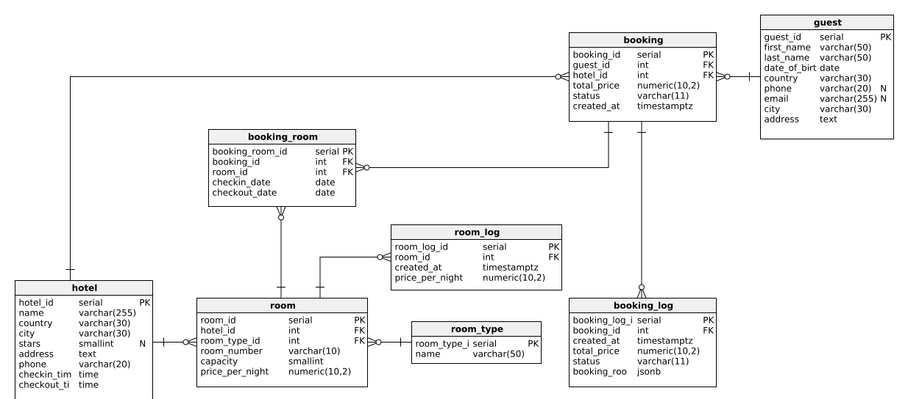

# System rezerwacji hotelowych

**Autorzy:** Jakub Fabia · Michał Gontarz

---

## 1. Model danych



Kompletne definicje SQL znajdują się w pliku [`sql/tables.sql`](./sql/tables.sql).

---

<div style="page-break-after: always;"></div>


### 1.1 Tabela `hotel`

> Jednostka noclegowa widoczna w wynikach wyszukiwania (hotel, pensjonat, domek, hostel). Osoba zarządzająca hotelem ma dostęp do raportów sprzedaży i logów.

| Kolumna       | Typ                  | Klucz / ograniczenia         | Znaczenie                                  |
| ------------- | -------------------- | ---------------------------- | ------------------------------------------ |
| hotel_id      | SERIAL               | **PK**                       | Identyfikator hotelu                       |
| name          | VARCHAR **NOT NULL** |                              | Nazwa obiektu widoczna w ofercie           |
| country       | VARCHAR **NOT NULL** |                              | Kraj                                       |
| city          | VARCHAR **NOT NULL** |                              | Miasto / miejscowość                       |
| stars         | SMALLINT             | NULL OR 1 ≤ stars ≤ 5        | Oficjalna kategoryzacja (1–5★)             |                   |
| address       | TEXT **NOT NULL**    |                              | Ulica + nr domu/mieszkania                 |
| phone         | VARCHAR **NOT NULL** | UNIQUE                       | Telefon recepcji                           |
| checkin_time  | TIME **NOT NULL**    | checkin_time > checkout_time | Standardowa godzina zameldowania           |
| checkout_time | TIME **NOT NULL**    |                              | Standardowa godzina wymeldowania           |
---
> Każda czwórka (name, country, city, adress) musi być unikalna.

<div style="page-break-after: always;"></div>

### 1.2 Tabela `room_type`

> Globalny katalog kategorii pokoi oferowanych na platformie (np. pokój hotelowy, apartament, domek, łóżko hostelowe).

| Kolumna     | Typ                   | Klucz / ograniczenia | Znaczenie                                       |
| ----------- | --------------------- | -------------------- | ----------------------------------------------- |
| type_id     | SERIAL                | **PK**               | Identyfikator typu                              |
| name        | VARCHAR **NOT NULL**  |     UNIQUE                 | Nazwa kategorii ("Apartament", "Łóżko"...)      |
---

<div style="page-break-after: always;"></div>

### 1.3 Tabela `room`

> Każda fizyczna jednostka noclegowa (konkretny pokój 101, domek 5, łóżko #4 w hostelu).

| Kolumna     | Typ                      | Klucz / ograniczenia                  | Znaczenie                       |
| ----------- | ------------------------ | ------------------------------------- | ------------------------------- |
| room_id     | SERIAL                   | **PK**                                | Identyfikator pokoju            |
| hotel_id    | INT   **NOT NULL**       | FK części skł. PK → `hotel` | Hotel, do którego należy pokój  |
| room_type_id     | INT   **NOT NULL**       | FK części skł. PK → `room_type` | Kategoria pokoju |
| room_number | VARCHAR **NOT NULL**     | UNIQUE(hotel_id, room_number)         | Numer "jednostki noclegowej"    |
| capacity    | SMALLINT **NOT NULL** | capacity > 0         | Liczba osób, które można zakwaterować           |
| price_per_night | NUMERIC **NOT NULL**  | price > 0                | Aktualna cena za noc               |
---

<div style="page-break-after: always;"></div>

### 1.4 Tabela `room_log`

> Historia zmian statusu dla każdego pokoju (dla raportów o poszczególnych pokojach).

| Kolumna       | Typ           | Klucz / ograniczenia | Znaczenie                     |
| ------------- | ------------- | -------------------- | ----------------------------- |
| room_log_id   | SERIAL        | **PK**               | Klucz sztuczny                |
| room_id       | INT           | FK → `room`          | Obiekt, którego dotyczy wpis  |
| created_at    | TIMESTAMPTZ   | DEFAULT now()        | Znacznik czasu zmiany         |
| price_per_night | NUMERIC **NOT NULL**  | price > 0                | Aktualna cena za noc  

---

<div style="page-break-after: always;"></div>

### 1.5 Tabela `guest`

> Dane kontaktowe klienta składającego rezerwację.

| Kolumna                | Typ                  | Klucz / ograniczenia    | Znaczenie                  |
| ---------------------- | -------------------- | ----------------------- | -------------------------- |
| guest_id               | SERIAL               | **PK**                  | Identyfikator gościa       |
| first_name / last_name | VARCHAR **NOT NULL** |                         | Imię i nazwisko            |
| date_of_birth          | DATE **NOT NULL**    | date_of_birth < today   | Data urodzenia             |
| country         | VARCHAR **NOT NULL** |                         | Kraj zamieszkania        |
| city         | VARCHAR **NOT NULL** |                         | Miasto zamieszkania        |
| address                | TEXT **NOT NULL**    |                         | Ulica + nr domu/mieszkania |
| phone                  | VARCHAR              | UNIQUE                  | Telefon kontaktowy         |
| email                  | VARCHAR              | UNIQUE                  | E‑mail                     |

---
> Jedna z wartości w dwójce (email, phone) musi być NOT NULL.

<div style="page-break-after: always;"></div>

### 1.6 Tabela `booking`

> Nagłówek rezerwacji (dane wspólne dla wszystkich pokoi w jednym zamówieniu).

| Kolumna                      | Typ                  | Klucz / ograniczenia       | Znaczenie                      |
| ---------------------------- | -------------------- | -------------------------- | ------------------------------ |
| booking_id                   | SERIAL               | **PK**                     | Identyfikator zamówienia       |
| guest_id                     | INT   **NOT NULL**   | FK → `guest`               |                                |
| hotel_id    | INT   **NOT NULL**       | FK części skł. PK → `hotel` | Hotel, do którego należy pokój  |
| total_price                  | NUMERIC **NOT NULL** | total_price > 0            | Kwota za całe zamówienie       |
| status                       | VARCHAR **NOT NULL** | DEFAULT 'PENDING'          | Aktualny status rezerwacji     |
| created_at                   | TIMESTAMPTZ **NOT NULL** | DEFAULT now()              | Data utworzenia rezerwacji     |

---

<div style="page-break-after: always;"></div>

### 1.7 Tabela `booking_room`

> Szczegóły rezerwacji — które pokoje wchodzą w skład jednego `booking` i z jakimi dodatkami.

| Kolumna       | Typ                  | Klucz / ograniczenia  | Znaczenie                             |
| ------------- | -------------------- | --------------------- | ------------------------------------- |
| booking_room_id    | SERIAL                  | **PK** fk → `booking` |                                       |
| booking_id       | INT **NOT NULL**             | FK część skł. PK -> `booking'     |                      Identyfikator zamówienia |
| room_id | INT **NOT NULL**    | FK część skł. PK -> `room`    | Rezerwowany pokój          |
| checkin_date  | DATE **NOT NULL**    | checkout > checkin    | Data zameldowania                     |
| checkout_date | DATE **NOT NULL**    | checkout > checkin    | Data wymeldowania                     |
---

<div style="page-break-after: always;"></div>

### 1.8 Tabela `booking_log`

> Migawka zmian rezerwacji obejmująca główne pola oraz listę pokojów (w formacie JSON).

| Kolumna                      | Typ            | Klucz / ograniczenia  | Znaczenie                                                                |
| ---------------------------- | -------------- | --------------------- | ------------------------------------------------------------------------ |
| booking_log_id               | SERIAL         | **PK**                |                                                                          |
| booking_id                   | INT **NOT NULL**           | FK → `booking`        |                                                                          |
| created_at                   | TIMESTAMPTZ **NOT NULL**   | DEFAULT now()         |                                                                          |
| total_price                  | NUMERIC **NOT NULL** | total_price > 0            | Kwota za całe zamówienie       |
| status                       | VARCHAR **NOT NULL**        |                       | Nowy status zamówienia                                                   |
| booking_rooms                | JSONB **NOT NULL**         |                       | Nowe szczegóły zamówienia w formie `{room_id, checkin, checkout}` |

---

### 1.9 Założenia i uproszczenia

* Ceny sezonowe nie są modelowane — zakładamy jedną stawkę `price_per_night` na dany pokój
* Obsługa płatności nie będzie implementowana.

### 1.10 Kod generujący tabele

```sql
CREATE TABLE hotel (
  hotel_id      SERIAL       PRIMARY KEY,
  name          VARCHAR(255) NOT NULL,
  country       VARCHAR(30)  NOT NULL,
  city          VARCHAR(30)  NOT NULL,
  stars         SMALLINT,
  address       TEXT         NOT NULL,
  phone         VARCHAR(20)  NOT NULL,
  checkin_time  TIME         NOT NULL,
  checkout_time TIME         NOT NULL
);

CREATE TABLE room_type (
  room_type_id     SERIAL      PRIMARY KEY,
  name             VARCHAR(50) NOT NULL
);

CREATE TABLE room (
  room_id         SERIAL        PRIMARY KEY,
  hotel_id        INT           NOT NULL REFERENCES hotel,
  room_type_id    INT           NOT NULL REFERENCES room_type,
  room_number     VARCHAR(10)   NOT NULL,
  capacity        SMALLINT      NOT NULL,
  price_per_night NUMERIC(10,2) NOT NULL
);

CREATE TABLE room_log (
  room_log_id     SERIAL         PRIMARY KEY,
  room_id         INT            NOT NULL REFERENCES room,
  created_at      TIMESTAMPTZ    NOT NULL DEFAULT now(),
  price_per_night NUMERIC(10,2)  NOT NULL
);

CREATE TABLE guest (
  guest_id      SERIAL       PRIMARY KEY,
  first_name    VARCHAR(50)  NOT NULL,
  last_name     VARCHAR(50)  NOT NULL,
  date_of_birth DATE         NOT NULL,
  country       VARCHAR(30)  NOT NULL,
  city          VARCHAR(30)  NOT NULL,
  address       TEXT         NOT NULL,
  phone         VARCHAR(20),
  email         VARCHAR(255)
);

CREATE TABLE booking (
  booking_id     SERIAL         PRIMARY KEY,
  guest_id       INT            NOT NULL REFERENCES guest,
  hotel_id       INT            NOT NULL REFERENCES hotel,
  total_price    NUMERIC(10,2)  NOT NULL,
  status         VARCHAR(11)    NOT NULL DEFAULT 'PENDING',
  created_at     TIMESTAMPTZ    NOT NULL DEFAULT now()
);

CREATE TABLE booking_room (
  booking_room_id SERIAL        PRIMARY KEY,
  booking_id      INT           NOT NULL REFERENCES booking,
  room_id         INT           NOT NULL REFERENCES room,
  checkin_date    DATE          NOT NULL,
  checkout_date   DATE          NOT NULL
);

CREATE TABLE booking_log (
  booking_log_id SERIAL         PRIMARY KEY,
  booking_id     INT            NOT NULL REFERENCES booking,
  created_at     TIMESTAMPTZ    NOT NULL DEFAULT now(),
  total_price    NUMERIC(10,2)  NOT NULL,
  status         VARCHAR(11)    NOT NULL,
  booking_rooms  JSONB          NOT NULL
);
```

<div style="page-break-after: always;"></div>

## 2. Reguły integralności & indeksy

Reguły integralności oraz indeksy poprawiające wydajność opisano w pliku [`sql/constraints_indexes.sql`](./sql/constraints_indexes.sql).


Poza wypisanymi w tabelce ograniczeniami dodano:
* Wymaganie co najmniej jednego kontaktu (telefon lub e‑mail) w tabeli `guest`.
* Brak nakładających się rezerwacji na ten sam pokój.

```sql
ALTER TABLE hotel
  ADD UNIQUE(name, country, city, address),
  ADD UNIQUE(phone),
  ADD CHECK (stars IS NULL OR stars BETWEEN 1 AND 5),
  ADD CHECK (checkin_time > checkout_time);

ALTER TABLE room_type
  ADD UNIQUE (name);

ALTER TABLE room
  ADD UNIQUE(hotel_id, room_number),
  ADD CHECK (price_per_night > 0),
  ADD CHECK (capacity > 0);

ALTER TABLE guest
  ADD UNIQUE(email),
  ADD UNIQUE(phone),
  ADD CHECK (date_of_birth < CURRENT_DATE),
  ADD CHECK (email IS NOT NULL OR phone IS NOT NULL);

ALTER TABLE booking
  ADD CHECK (total_price > 0),
  ADD CHECK (status IN ('PENDING', 'CONFIRMED', 'CANCELLED', 'CHECKED IN', 'COMPLETED'));

ALTER TABLE booking_room
  ADD CHECK (checkout_date > checkin_date);

CREATE EXTENSION IF NOT EXISTS btree_gist;

ALTER TABLE booking_room
  ADD CONSTRAINT no_room_overlap
  EXCLUDE USING gist (
       room_id                                  WITH =,
       daterange(checkin_date, checkout_date)   WITH &&
  );
```

<div style="page-break-after: always;"></div>

Utworzyliśmy także indeksy poprawiające wydajność bazy danych:
* Na klucze obce (PostgreSQL nie tworzy ich automatycznie).
* Do wyszukiwania dostępnych pokoi (`hotel_id + room_type_id`).
* Do sprawdzania rezerwacji między datami.
* Do logów po dacie utworzenia.


```sql
CREATE INDEX idx_room_hotel       ON room            (hotel_id);
CREATE INDEX idx_room_type        ON room            (room_type_id);
CREATE INDEX idx_booking_guest    ON booking         (guest_id);
CREATE INDEX idx_booking_room_room ON booking_room    (room_id);

CREATE INDEX idx_room_hotel_type ON room (hotel_id, room_type_id);

CREATE INDEX idx_booking_room_dates ON booking_room (checkin_date, checkout_date);

CREATE INDEX idx_room_log_room_ts ON room_log (room_id, created_at DESC);
CREATE INDEX idx_booking_log_booking_ts ON booking_log (booking_id, created_at DESC);
```

<div style="page-break-after: always;"></div>

## 3. Triggery

Do obsługi takich rzeczy jak:
* Tworzenie logów (wraz z tworzeniem JSON do `booking_log`),
* Kontrola rezerwacji pokoi (w jednej rezerwacji mogą znajdować się tylko pokoi z tego samego hotelu),

wykorzystano triggery.

```sql
CREATE OR REPLACE FUNCTION trg_room_status_log()
RETURNS trigger LANGUAGE plpgsql AS $$
BEGIN
  INSERT INTO room_log(room_id, created_at, price_per_night)
  VALUES (NEW.room_id, now(), NEW.price_per_night);
  RETURN NEW;
END $$;

CREATE TRIGGER room_aiu_log
AFTER INSERT OR UPDATE ON room
FOR EACH ROW EXECUTE FUNCTION trg_room_status_log();

CREATE OR REPLACE FUNCTION f_insert_booking_log()
RETURNS trigger LANGUAGE plpgsql AS $$
DECLARE
  b          booking;
  rooms_json jsonb;
BEGIN
  SELECT * INTO b FROM booking WHERE booking_id = NEW.booking_id;

  SELECT jsonb_agg(jsonb_build_object(
           'room_id',       room_id,
           'checkin_date',  checkin_date,
           'checkout_date', checkout_date))
    INTO rooms_json
  FROM booking_room
  WHERE booking_id = NEW.booking_id;

  INSERT INTO booking_log(booking_id, created_at, total_price, status, booking_rooms)
  VALUES (b.booking_id, now(), b.total_price, b.status, COALESCE(rooms_json, '[]'::jsonb));
  RETURN NEW;
END $$;

CREATE TRIGGER booking_aiu_log
AFTER INSERT OR UPDATE ON booking
FOR EACH ROW EXECUTE FUNCTION f_insert_booking_log();

CREATE OR REPLACE FUNCTION check_booking_rooms_same_hotel()
RETURNS TRIGGER AS $$
DECLARE
    existing_hotel_id INT;
    new_room_hotel_id INT;
BEGIN
    SELECT r.hotel_id INTO new_room_hotel_id
    FROM room r
    WHERE r.room_id = NEW.room_id;

    SELECT r.hotel_id INTO existing_hotel_id
    FROM booking_room br
    JOIN room r ON r.room_id = br.room_id
    WHERE br.booking_id = NEW.booking_id
    LIMIT 1;

    IF existing_hotel_id IS NOT NULL AND existing_hotel_id <> new_room_hotel_id THEN
        RAISE EXCEPTION 'All rooms in a single booking must belong to the same hotel.';
    END IF;

    RETURN NEW;
END;
$$ LANGUAGE plpgsql;

CREATE TRIGGER trg_check_booking_room_hotel
BEFORE INSERT ON booking_room
FOR EACH ROW
EXECUTE FUNCTION check_booking_rooms_same_hotel();
```
---


## 6. Możliwości technologii wykorzystanych w projekcie

- Zapisywanie plików JSON w tabeli SQL
- Użycie indeksu GiST do warunku integralnościowego nakładających się rezerwacji na ten sam pokój